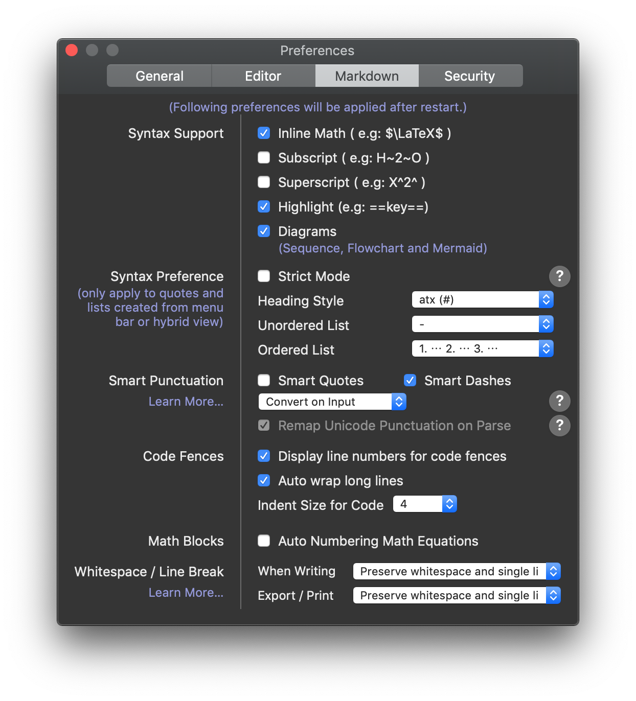

# Complexity summary

> *Created based on Algorithms and Analysis COSC1285 Sem 1 RMIT 2019*
>
> <u>If the content is outdated or need to be updated, please feel free to fork :-)</u>

Live preview: https://austinph.me/AAComplexity/  
Download: https://github.com/rockmanvnx6/AAComplexity/raw/master/download.pdf  
Edit on your own: https://github.com/rockmanvnx6/AAComplexity/blob/master/edit.md  

#### How to edit

I use typora (https://typora.io/). But it should works any Markdown editors that support LaTex

Setting:

